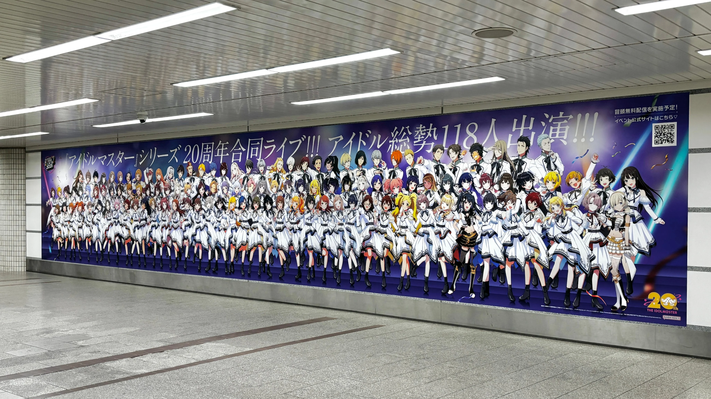
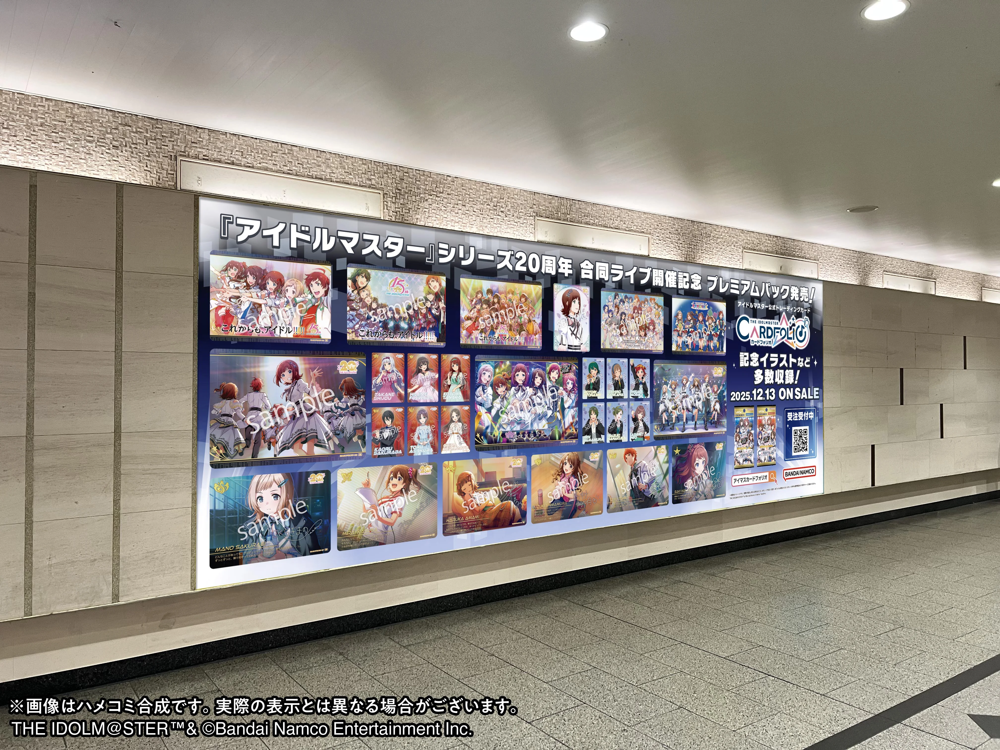
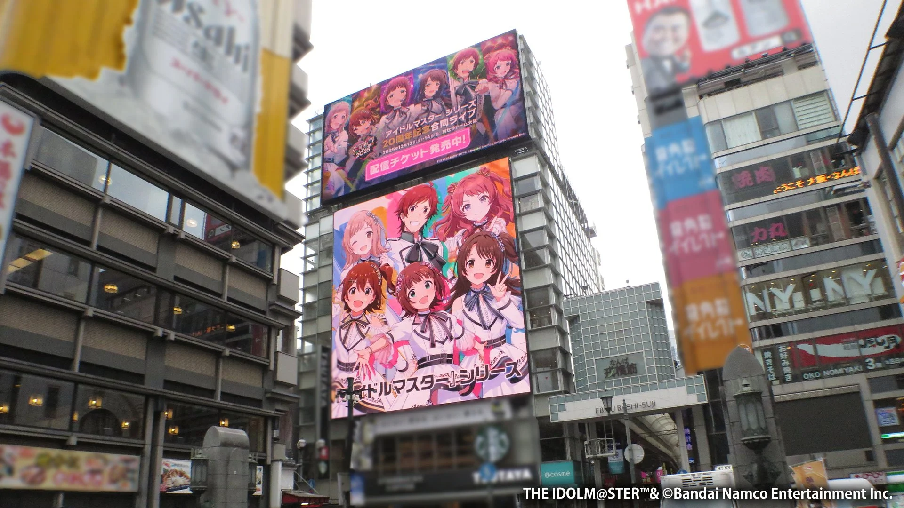
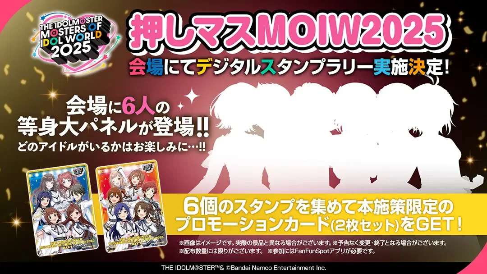
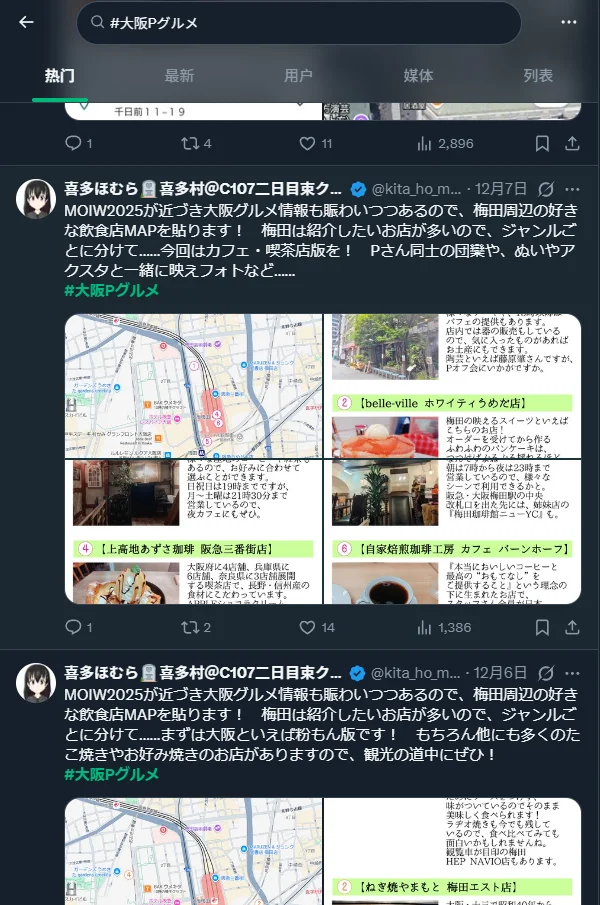
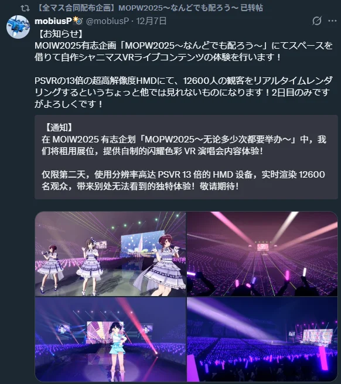

在开始介绍之前，因为官方已经发布了他们自己的一个汇总省流贴，所以放在这里备用：https://idolmaster-official.jp/news/01_17517

但是因为除了官方的活动以外，在场外还有很多P自发组织的活动，所以做了一个单独的页面来整合官方和同人自发组织的活动。

## 官方相关陈列

### 在车站内可以找到的

#### 难波站特别广告

◤￣￣￣￣￣￣￣￣￣￣￣￣￣￣  
偶像大师MOIW2025 举办纪念‼️  
难波站出现特别广告✨  
＿＿＿＿＿＿＿＿＿＿＿＿＿＿◢

视觉广告＆海报广告两种，共3面正在展示中✨  
所有出演偶像按身高顺序排列✨

🎉地点  
难波站 御堂筋线 南北自由通道

🎉期间  
至12月14日(周日)为止(预定)

*详情链接：https://x.com/imas_official/status/1997924119472402540?s=20*

#### 梅田站小卡墙

广告设置在阪急大阪梅田站D-street。  
※宣传卡的派发数量有限，每人限领一张。前往广告张贴地点时，派发可能已经结束。敬请谅解。  
※派发的宣传卡也计划在今后的宣传活动或促销活动中派发。  
※请勿以转售为目的获取卡片，也请勿转售卡片本身。  
※请勿向车站工作人员咨询。

*详情链接：https://x.com/imas_official/status/1997792505455403127?s=20*

### 在室外可以找到的

#### MOIW25室外广告屏

／  
偶像大师MOIW2025  
大阪正在投放视觉广告‼️  
＼

🎉地点  
・Adobe Vision 难波  
・EDION VISION 难波  
・TSUTAYA EBISUBASHI HIT VISION  
・道顿堀站  
・难波戎桥多媒体VISION  
・http://RIBIA.TV（心斋桥）

🎉期间  
截至12月14日（周日）（预定）

*详情链接：https://x.com/imas_official/status/1997949297934110915?s=20*

> 这个广告也还有闪彩虹之行方的广告投放。

#### 道顿堀广告游船

◤￣￣￣￣￣￣￣￣￣￣￣￣￣￣￣  
偶像大师MOIW2025 举办纪念‼️  
道顿堀广告巡游船登场决定🚢  
＿＿＿＿＿＿＿＿＿＿＿＿＿＿＿◢

路过附近的时候请务必来看看哦♪

🎉地点  
预定在道顿堀川浮庭桥～日本桥之间巡游

🎉航行时刻表（预定）  
12/12(周五) 15:30-20:30  
12/13(周六) 10:00-15:00  
12/14(周日) 10:00-15:00

*详情链接：https://x.com/imas_official/status/1997950526273572866?s=20*

### 在会场可以找到的

#### 粉丝旗子展示

点亮大阪京瓷巨蛋！原创旗帜制作权

为“THE IDOLM@STER M@STERS OF IDOL WORLD 2025”  
我们将把各位制作人募集的设计制成的“旗帜”悬挂在会场周边！  

提交设计的朋友还将收到原创旗帜的实物样品！  

无论是刊登祝贺偶像演出的插画，  
还是与同事、同伴们一起送上留言，  
为了让演出和《偶像大师》20周年更加精彩，  
恳请各位制作人的协助！

*详情链接：https://idolmaster-official.jp/live_event/idolworld2025/special/flag_produce.php*

#### 痛车展示活动

- 举办日期：2025年12月13日（周六）～14日（周日）
- **地点：MOIW2025会场 邻近特设会场**

※由于在室外举行，车辆预计将停放在无顶棚区域。  
※即使下雨，活动仍将在室外举行，不作更改。此外，会场内部装饰和企划内容可能会有少量修改。但如遇恶劣天气，活动可能会中止。  
※搬入展示会场时有斜坡，请注意。  
此外，部分区域无法通行高度超过地表2.7米的车辆。如果车辆高度超过此限制，即使中选也可能无法参加当日活动。  

- 时间
	- 入场时间 7:00～8:00
	- **展示时间 10:00～15:00**
	- 离场（车辆驶离）时间 20:00～22:30

※只有在展示时间内，没有“MOIW2025 DECOR@TION CAR MEETING 制作权”的顾客也可以入场。  

*详情链接：https://idolmaster-official.jp/live_event/idolworld2025/special/car_produce.php*

#### 集章活动 【⚠️需要日本手机号】

> ~~这个活动似乎需要有日本的手机号才可以操作？~~ 经过测试之后确实发现是需要一个日本手机号通过验证了才可以使用APP的

*   **活动名称**：MOIW2025 数字盖章拉力赛
*   **活动日期**：2025年12月13日（周六）、14日（周日）
*   **活动时间**：**10:00 ～ 16:00**（两天均为开演前结束，请预留充足时间）
*   **活动地点**：大阪京瓷巨蛋（Kyocera Dome Osaka）周边区域

**📍 去哪里找印章（共6个点位）**

你需要找到放置在以下位置的**等身大立牌**，扫描旁边的二维码。点位分布在“京瓷巨蛋”和附近的“Super Viva Home”商场：

**【京瓷巨蛋大阪 (Kyocera Dome Osaka)】**
1.  **2楼** 体育场商城 (Stadium Mall)：STADIUM B-SITE
2.  **2楼** 体育场商城 (Stadium Mall)：BsSQUARE
3.  **3楼** 中央广场 (Central Plaza)：物贩区域
4.  **1楼** 巴士乘降处 (Bus Stop)：旗帜展示区 (のぼり展示エリア)

**【Super Viva Home 大阪巨蛋城店 (就在巨蛋旁边)】**

5. **1楼** 建材馆 (資材館) 电梯厅
6. **屋顶层 (Rooftop)** 电梯厅

**📱 具体操作步骤**

1.  **下载APP**：
    提前在手机上下载并安装 **“Bandai Namco Fan Fun Spot”** 应用程序（App Store 或 Google Play）。
2.  **绑定账号（重要）**：
    在APP内登录并绑定您的 **Bandai Namco ID**。
    *   *注意：必须完成“来电认证（着信認証）”才能参加，建议提前在家做好。*
3.  **收集印章**：
    到达上述6个地点，打开APP扫描立牌旁的二维码，集齐全部6个印章。
4.  **生成兑换券**：
    集齐后，APP内会自动发放“特典兑换券（Coupon）”。
    *   **⚠️ 绝对禁止的操作**：**在见到工作人员之前，千万不要点击“使用”按钮！** 如果您自己不小心点了导致状态变为“已使用”，将无法领取奖品。
5.  **领取奖品**：
    前往 **京瓷巨蛋 1楼 巴士乘降处 特设展位（特典交换所）**，向工作人员出示手机画面进行核销兑换。

**🎁 奖品信息**

*   **奖品内容**：本活动限定的 **Card Folio 促销卡片套装（2张组）**。
*   **领取限制**：活动期间（12/13-14），每人仅限领取 **1次**。
*   **数量限制**：数量有限，送完即止（先到先得）。

*相关链接：https://idolmaster-official.jp/live_event/idolworld2025/special/stamp_rally.php*

## 同人相关活动

### 推特 \#大阪Pグルメ tag

合同直播前两周，宣传大阪P美食地图

**\#大阪Pグルメ** 目前已收到约470家各类餐饮店的合作企划、志愿者分发企划、巡演大师设置店、交通指南等信息，并已整理汇总。请务必加以利用  

地图链接：https://google.com/maps/d/u/1/edit?mid=1zQ3xTwSr40EUhRqmbR6IELBzePEB_PM&usp=sharing

当然，推荐还是使用X然后直接访问这个tag，可以看到非常多的内容。主要以大阪的美食为主。

### 无料发放活动

用X查看下方的账号，查看其转发的推文，就可以大致了解到时候有什么内容。

[官方X账号点击此处查看](https://x.com/ddf_imcg)

活动举办日期与时间为：**12月13日（星期六）上午11:00至下午2:30，以及12月14日（星期日）上午10:00至下午2:00**。两天的结束时间不同。

活动地点在[大阪府立体育会馆](https://maps.app.goo.gl/3JYYL7QGcRWbiNtL7)（EDION ARENA OSAKA）的第2至第4会议室。该地点靠近**难波站**和**日本桥**，从演唱会主会场前往需要搭乘电车，相距2站。

【**分发企划会做些什么**】   
分发企划者分发与偶像相关的物品，一般参加者在会场领取分发物 类似于没有金钱交易的同人志即卖会 这样更容易理解。

【**企划参与者会分发什么？**】（过往案例）   
- 偶像或组合的介绍手册或宣传传单
- 应援荧光棒的分发
- 宣传周边物品的分发
- 分发关于应援的呼吁等手册（例如：应援口号指南或荧光棒颜色指南等）

也还有其他如**旗帜展示、娃娃展示**以及更多的活动内容。

---

同时**法政大学**也有自己的无料发放环节，和这个并不在一个地方：https://x.com/hoseimaster/status/1994360641831014767?s=20

## 最后的预习

因为时间不够多了，所以太长的预习歌单（~~比如一天的演出整个歌单播放时间有个十几个小时的~~）就不考虑了。这里放几个我自己用的预习资料（什

- D1全企划预习歌单：https://open.spotify.com/playlist/7nqadLZ96vrc3PYHq5wy3A?si=4v3gyv0lQY6hMW9KsJXmZw
- D2全企划预习歌单：https://open.spotify.com/playlist/14PcP91pIJGXAqvuOZWOcb?si=niXLtZXeTQWQCELgv8hhCw
- 偶像大师官方 2014-2015 live名场面：https://www.bilibili.com/video/BV1YJ2LBmEHb/

当然因为本/闪/学我自己已经听的比较多了所以预习的时候可以跳过，在这个note的文章中可以按照企划查看作者已经制作好的spotify歌单。

https://note.com/sanagi_cocoonm/n/n36173e60fc58?sub_rt=share_sb