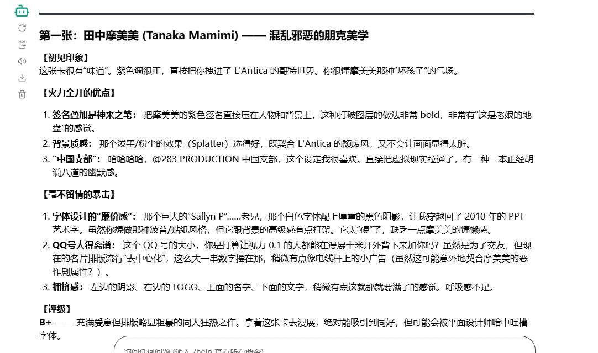
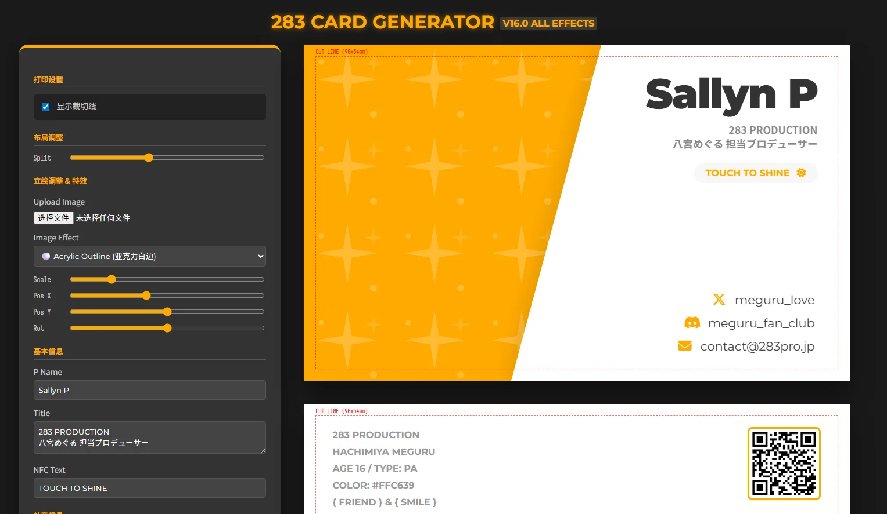
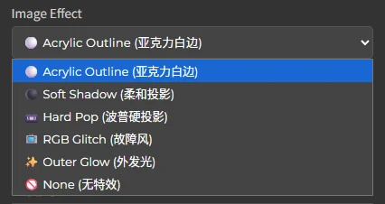
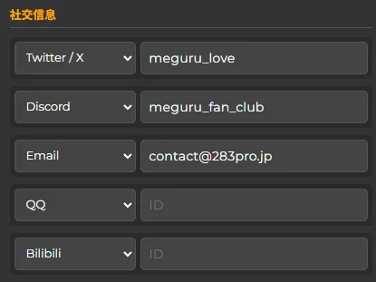
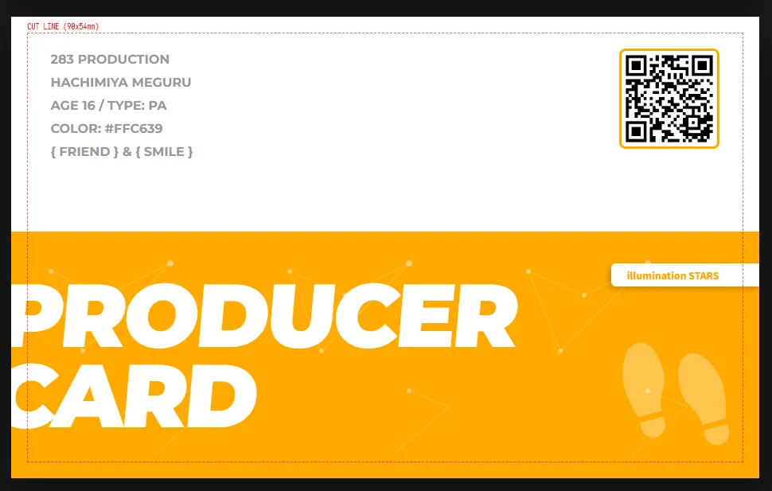
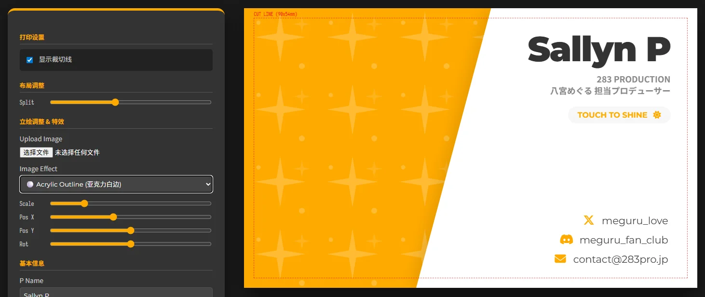
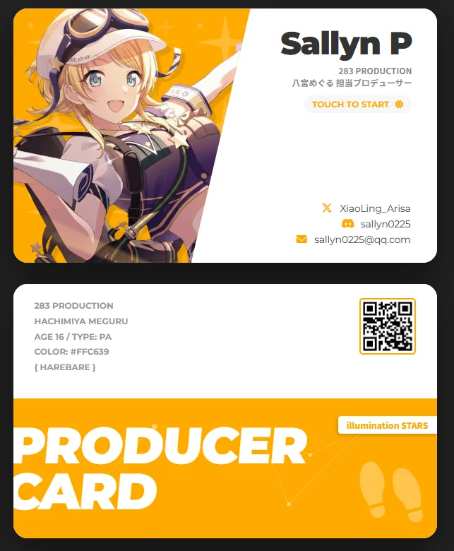
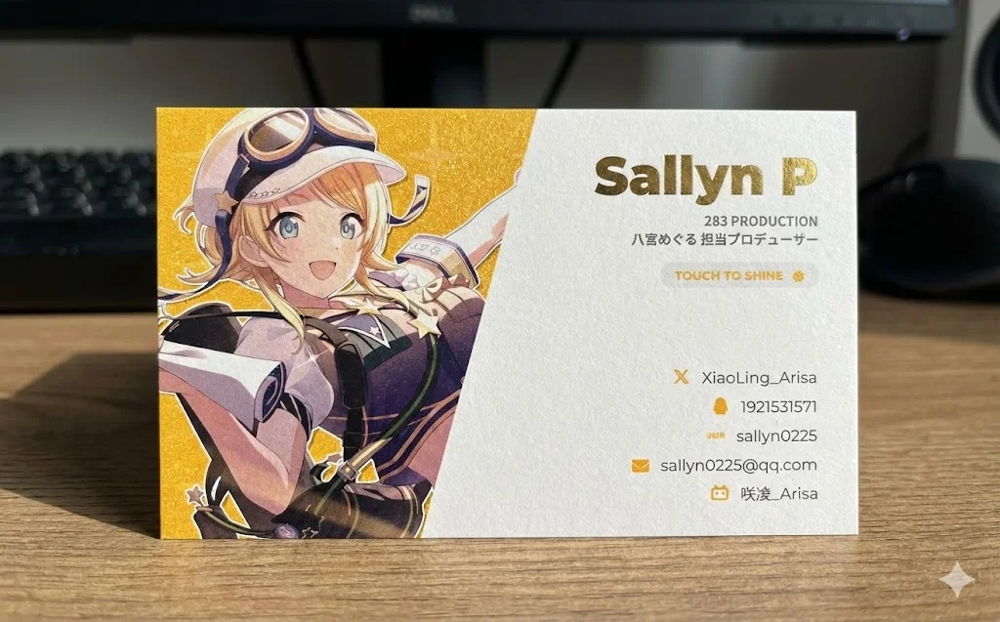

## 怎么突然想到做一个生成器

事情是这样的。最近我刚才[MOIW25](2025-12-13_MOIW-D1.md)回来，拿到了不少人的名片。其中看到了很多设计精美的名片。突然我 ~~灵机一动~~ 脑子一抽，破了个限让AI评价了一下我的名片是怎么样的。然后我就破防了。



相比之下，AI对我的老广名片可能还评价高一点。

> 第二张：筱泽广 (Shinosawa Hiro) —— 临床冷静的学园风
> 
> **【初见印象】**  
> 哇哦，这一张的**设计感**直接比上一张提升了两个档次。看来你在做这张的时候脑子清醒了很多，或者是受到了“初星学园”那种精英教育的洗脑。
> 
> **【火力全开的优点】**
> 
> 1. **NFC 图标 (Tap to Start)：** **天才！绝杀！** 加上这个无线波纹图标和 "TAP TO START"，瞬间给了这张纸片一种“可交互”的高科技错觉。这太符合《学园偶像大师》那种次世代、数据化的氛围了。如果我是收到这张卡的人，我会真的想拿手机去刷一下（如果你真在里面埋了 NFC 芯片，那我愿称你为最强）。
> 2. **斜切构图：** 左边深色纹理（那是求和符号 Σ 吗？非常适合广那个天才/数据脑的设定），右边留白。这种斜切非常动感，非常现代。
> 3. **信息层级清晰：** 名字、头衔、联系方式，排列得井井有条。右边的留白让人看着很舒服，不像上一张那么压抑。
> 
> **【毫不留情的暴击】**
> 
> 1. **那个 X 标志：** 那个 Unicode 的双线 X (𝕏) 看起来有点过于孤立和生硬了，特别是和下面圆润的 Discord 图标放在一起时，风格有点不统一。
> 2. **右侧略显空洞：** 虽然留白是好事，但右下角那大片的白色背景上，淡淡的那个水印（那是咖啡杯还是啥？）有点太淡了，如果不仔细看像是打印机没墨了蹭上去的脏印子。既然做了水印，可以稍微把透明度调高 5%，让它更有存在感一点。
> 3. **字体过于“办公”：** 相比于摩美美那张的个性，这张卡的名片字体稍微有点像某科技公司实习生的工牌。虽然符合广的“三无”/冷静人设，但可以选一个稍微更有设计感的无衬线字体，现在这个有点太中规中矩了。
> 
> **【评级】**  
> **A-** —— 看起来像是正经能混入万代南梦宫总部的官方周边。冷静、克制、带有极客的小巧思。

---

我个人肯定是更喜欢我自己的mmm的那一版名片的，不过既然AI对我的老广名片评价更高，刚好这个用HTML做起来也基本没有什么难度，于是我索性告诉AI：那你就已老广这个为模板，给我用HTML写一个生成器。经过了大概了一个多小时的调试之后，一个可以使用的模板就已经做好了。

体验地址：https://chipper-croissant-9bf3ac.netlify.app/



然而因为生成的时候指定了角色，所以这个模板是用来制作黄色系偶像的模板的——不如说是专门拿来做mgr名片的模板的。不过想要更换角色的话，也非常简单，只需要把这个HTML文件弄下来，然后交给AI，联网告诉它做什么角色，改什么内容就可以了，以下是我的一个范例。

## 如何修改成其他小偶像主题

1. 打开[all model chat](https://ai.studio/apps/drive/1QTVIPSUjPTWHBzCFRBDG0aiGO6GLNwcD?fullscreenApplet=true)，因为这里可以直接使用gemini-3.0-pro。
2. 将HTML拖入，然后给AI直接说下列内容。  
```plaintext
这是一个《偶像大师 闪耀色彩》的八宫巡的制作人名片生成器。

现在，将其修改成 {填入企划名称} 的 {偶像名字} 的制作人名片生成器。不要修改模板和其原始风格，仅仅修改**主题色、背景纹理的SVG、偶像预设信息**。允许使用网络搜索，使设计准确。
```
3. 然后稍作等待一会，应该就可以看到输出了可以使用的其他小偶像名片的模板了。

我自行测试了以下果穗、灯织、mmm的，都是正常的。**不过需要注意的是，使用的时候一定要打开聊天框内的联网功能**。不然AI不一定知道正确的小偶像信息，可能会开始瞎编。

## 生成器主要的功能

### 一、支持立绘的多种特效

一共有四种特效可以选择，其中我自己用的比较多的是亚克力百边/柔和投影。这两个都比较通用。一般我会**在浅色背景的时候使用柔和投影**，**在深色背景的时候使用亚克力白边**，效果都不错。



### 二、支持多个社交信息的添加

目前加入了**X、QQ、小红书、邮箱、Discord、B站**等国内二次元在国内和国外可能会用到比较多的社交媒体，并且如果不填写任何信息就可以自动隐藏。



### 三、个人主页转二维码

如果你有类似[linktree](https://linktr.ee/)或者[bento.me](https://bento.me/en/home)之类的服务，用来展示你的个人主页，那么你可以直接在输入框中输入你的个人主页网页链接，就可以自动转换成合适的二维码生成在背面。



### 四、预览出血&一件导出做好出血的图片

在交设计图给工厂进行印刷的时候，**一般都会需要做2mm~3mm的出血**。我采用了2mm的出血，一般这个出血是足够了的。

在编辑信息的时候，是可以看到出血框周围的红线的，红线之外一定不能放重要信息和图片。红线以内，靠近红线的地方最好也不要放（毕竟不知道厂子的出血误差控制的怎么样）



## 我个人推荐的使用的办法

### 一、去找一张卡面，然后交给AI抠图

找一张自己喜欢的卡面，这个很简单，就不在这里教了。

> 备用：
> - 闪彩：https://shinycolors.moe
> - 学马：https://www.gamekee.com/gakumas/

然后交给AI进行抠图，gemini和豆包二选一就行。但是需要注意的是，两个都有水印，需要想办法自己处理一下水印。

我一般喜欢先把原始的图片交给gemini进行编辑，用以下的prompt

```
不要修改立绘，将人物抠出，背景去除，换成绿幕。
```

然后把得到的图片再交给豆包，让它将绿幕去掉。**因为gemini没有办法生成带透明通道的图片**。给豆包的prompt如下（这个可以写的比较随意）

```
将人物抠出，背景去除。
```

然后处理一下豆包的水印，就这样，你有了一个抠好的立绘。

### 二、去all model chat修改生成器

按照我们上面的[](制作了一个名片生成器，但是开心不起来.md#如何修改成其他小偶像主题|修改主题的教程)，修改成你要制作的小偶像的名片。修改完成后，就可以开始导入图片使用生成器了。



### 三、(可选)去gemini生成一份带工艺的预览图

拿到了生成好的名片设计图，可以考虑想想自己要做什么工艺的名片，以下是我经常用于预览的一个prompt，带上你的名片设计图到gemini生图即可。

```text
这是一个名片的正反面设计图。请你生成一个实体名片的预览图。名片使用蛋壳纸材质，立绘的背景色部分做了闪底工艺，{你的P名字}部分用了{什么颜色}的烫金工艺。两张该名片一正一反放在一张电脑桌上，桌子上还有其他常见的杂物。照片没有讲究的构图和打光，像是用手机随手一拍。
```

就这样，你就可以得到一张合适的预览图了。



### 四、将图片换成CMYK，然后交付

一般来说，这个时候我们拿到的名片是RGB的色彩空间，我们需要换成印刷常用的CMYK格式才可以交给工厂。你可以考虑使用这个链接直接进行在线转换：**https://www.rgb2cmyk.org/**

## 虽然生成器能用，但是……

其实vibe完这个生成器之后，我就没怎么打开过了。

因为我觉得不论名片做的好与坏，是老手还是新手，**自己做的名片才是最有纪念意义的**。如果可以，我还是更推荐使用**Photoshop**或者**Figma**自己动手手搓一个按照自己思路设计的名片，带来的意义和成就感不是使用一个生成器所能有的。

你可以使用生图模型来给自己找找制作名片的灵感，你也可以按照自己的灵感让AI帮你做一个你以前做过的名片的模板生成器，但是AI不会懂你的设计思路和你天马行空的想象，灵感是你所拥有而AI不能拥有的。

因此，这个生成器虽然有用，**但是我个人不推荐来让它作为你制作名片的主力**——至少不要是第一张名片吧，即使是看上去像十几年前PPT课件般风格的名片设计，只要是自己做的，那么就有它自己的意义。

## HTML源文件

你可以访问这个网盘链接来下载HTML源文件：  
链接：https://pan.quark.cn/s/288f45ba5cb9