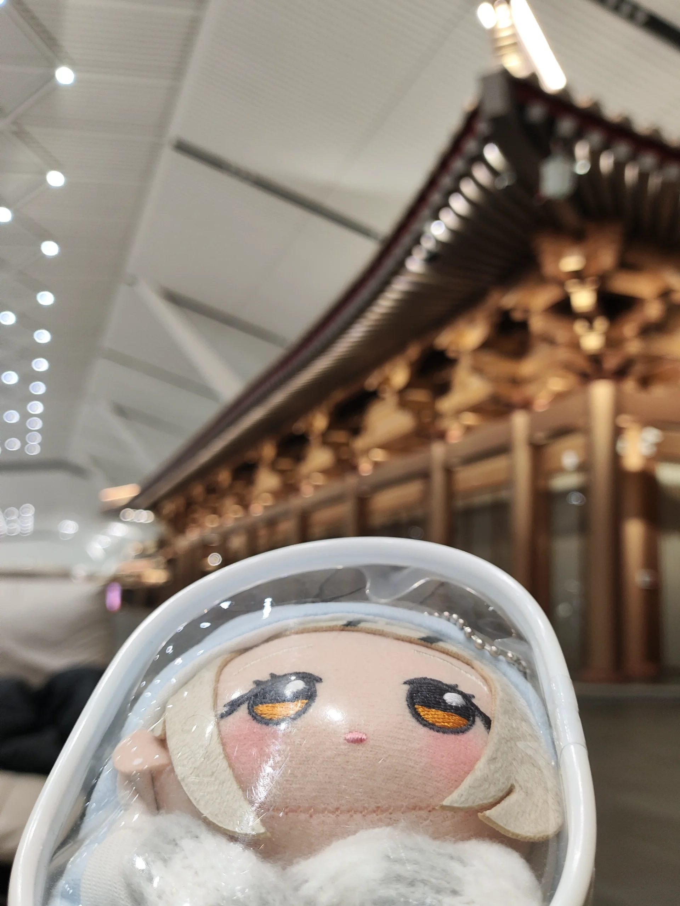
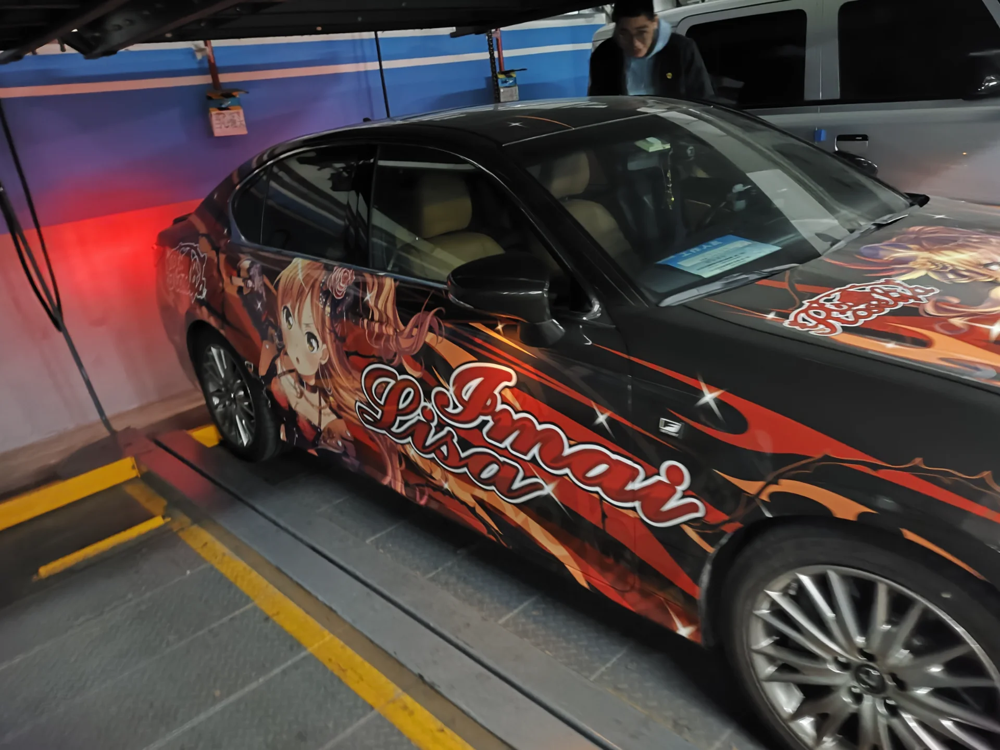
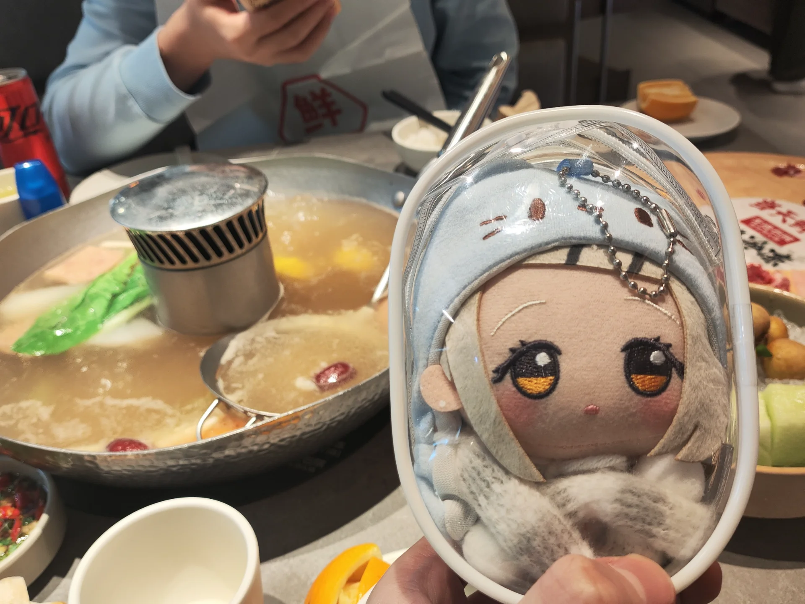
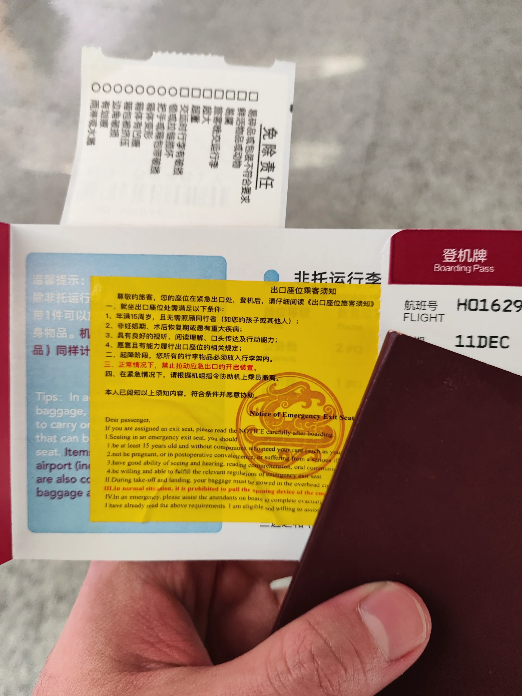
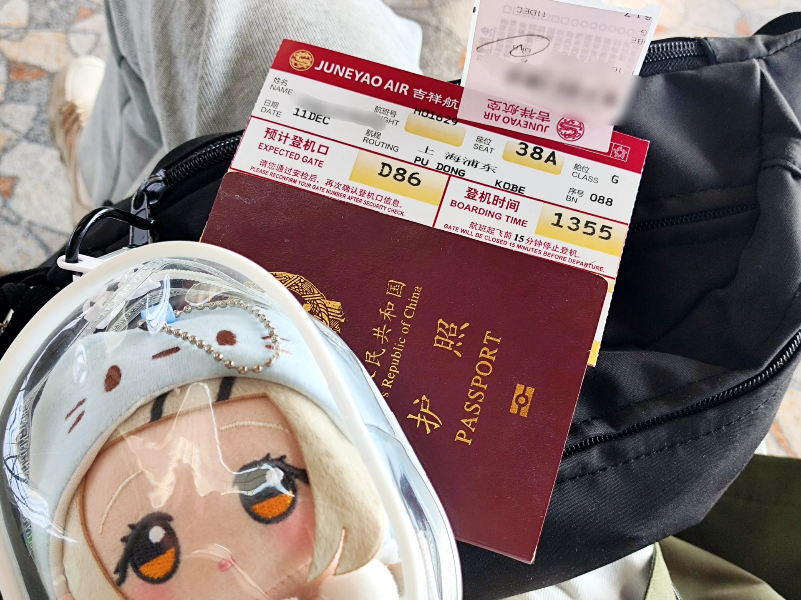
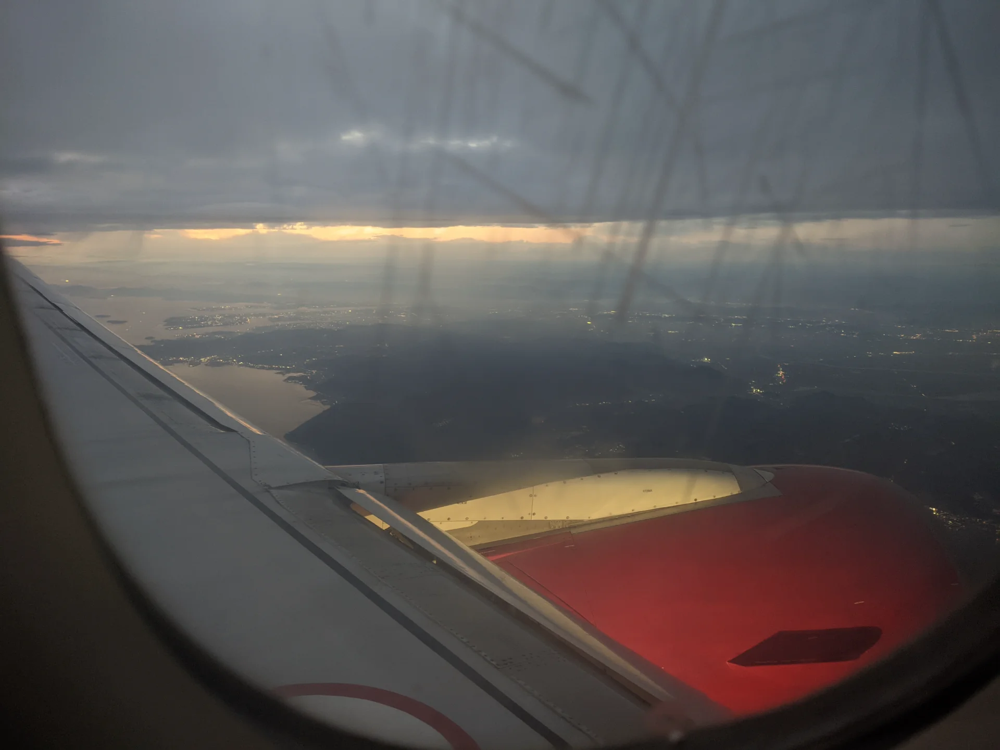

## 西安T5过夜初体验

因为前几次在西安T3过夜的体验并不好。虽然说除了正儿八经的过夜旅客休息区有椅子以外，其他地方的椅子虽然也能睡，但是睡起来非常的不舒服。于是这一次我选择在新开的西安T5航站楼过夜，第二天早上再坐接驳车前往西岸T3。

在小红书上可以搜索到不少西安t5过夜攻略。主要的攻略就是来到T5的出发层，也就是三楼，随后再往上一层来到一个博物馆的门前。这里便是有过夜沙发的地方

实际体验下来，这个位置确实非常舒服，可以做到大概120~150度左右的躺平。而且沙发很软，即使是在冬天的12月，机场里的暖气开的也非常足，只需要穿两件衣服差不多就可以正常的过夜了。

但是缺点也是有的。好像这个地方因为是新开的设施的原因，所以晚上沙发旁边的充电口是没有电的。也就是说必须在第二天的早上去T3充电，才有一个比较不错的电量使用情况——或者干脆晚上不玩手机也是可以的。~~然而我这会实在是睡不着觉，现在我的手机电量大概只有40了~~。恐怕早上起来我先得用充电宝充一下 然后再去T3的登机口充电。

## 前往上海

在早晨的五点多钟我醒了，并且很长一段时间没办法再次入睡，于是我选择起来然后吃了一下我提前准备好的早餐就出发去T3。

T3的换乘也很简单，直接去2F然后找到彩虹接驳（应该是这个名字）直接出门上车就行，大概15分钟就可以从T5到达T3。

今天看起来因为是工作日而且不是周五的原因，我值机的速度非常快，而且或许是因为国内转国际有专门的窗口，而且这次我把我的大火放在了背包而不是行李箱，所以一下子就完成了值机。~~之前每一次放在行李箱都会被开包检查说是电子烟~~。

就这样，或许这是我最顺利的一次值机，安检也是一下子就过去了，一改之前的作风。就这样非常正常的登上了去往上海的飞机。

## 和东哥的约饭

因为提前告知了东哥，这天我来上海中转，~~于是作为地主的东哥又一次请了我一顿饭~~，感恩戴德。还~~开着lisa号~~送我从SHA到了PVG，再次感恩戴德。

中午我们吃了顿火锅，好吃，可惜这次时间有点赶了，或许下一次有机会在日本见面的时候再在off会上好好搓一顿吧。

~~另外去PVG路上，我们在lisa号里放莲之空，车上载着我一个要去阪蛋看MOIW的帅友，确实是有些串了~~）

## 浦东值机 & 前往神户

告别东哥之后，我前往航站楼内办理值机和托运。值机的时候提了一嘴可不可以给我安排到紧急出口位置，在听完了说明事项之后，我成功获得了一张紧急出口的座位，看来线下每次值机的时候问一嘴还是非常管用的。

周四下午的浦东机场出境依旧没人，走了自助通道飞速出关。也就只有一个工作人员问了我一嘴去哪里，去干嘛，什么时候回来，叮嘱了一句注意安全就完成了出境的流程。

等我来到了登机口，小坐了20分钟，就差不多到了登机的时间。不过可惜没有看到同去看moiw的帅友有些遗憾。~~不过这班飞机又不直飞大阪而且还是下午这个时间段，恐怕确实没有多少人会选择~~。只是我比较喜欢神户罢了。

坐上了飞机之后，本来想睡个觉，但是可能是因为早上和中午喝茶喝多了，所以一直睡不着，索性就爬起来看闪5.5th的视频。看着看着又继续犯困，就这么反反复复，终于到了神户的上空。

## 入境小插曲之POVO没网

我的povo本来是已经提前设置好了APN的，但是不知是什么原因，一直到我落地了都没有网络。我不得不等到接驳巴士到了航站楼内然后连上WIFI开始确认具体情况。在确认过后，发现我的设置并没有问题。一气之下（主要还是因为机场里有网）重置了我的APN设定，结果网络就奇迹般的好了。于是我抓紧时间充了个3天的网络放题来用。

然后就是漫长的等待，因为神户这个入场的口子只开放了2个给外国人，于是排队时间异常漫长。而且加上过了关之后还要在指定的柜台再次给工作人员查验护照和vjw，又耽搁了我的时间，本来预估是可以在18:20上车的，实际可能晚了有差不多十分钟的时间。

## 神户港岛晚饭初体验

在朋友家放好了行李之后，便出门觅食。因为我从来没有在这个地方吃过饭，于是他带我去一家中餐馆吃饭。

中餐馆的位置是：https://maps.app.goo.gl/ppLWtHcRvTG67PNE7

入店后，服务员告诉我这里不能使用信用卡，不过注意到有paypay的码可以扫，于是我选择用微信扫码把这次的晚饭钱给付了。结果也确实成了，~~感觉小哥确实也是有点惊讶在的~~。

## 回到住处 准备休息

等到了住处，朋友给我打开了PS5让我看看有没有什么想看的东西。我也不怎么看新闻，所以我打开了MOIW25的预习歌单开始听。

这个时候他的室友似乎也饶有兴致的过来看了一眼，但是他一直也没和我搭话，我也自然社恐没好意思出声。看了一会之后困意袭来，朋友也去睡觉了，于是我飞速洗了个澡，然后就钻进了被炉。为明天的行程养足精力。