## 来神户四次，四次都是晴天

早上醒来，朋友和他的舍友都还没有醒来。因为我是睡在客厅的被炉里面，所以很早我就被外面的太阳照醒了。看到太阳，就知道今天神户的旅行大概是十拿九稳了。

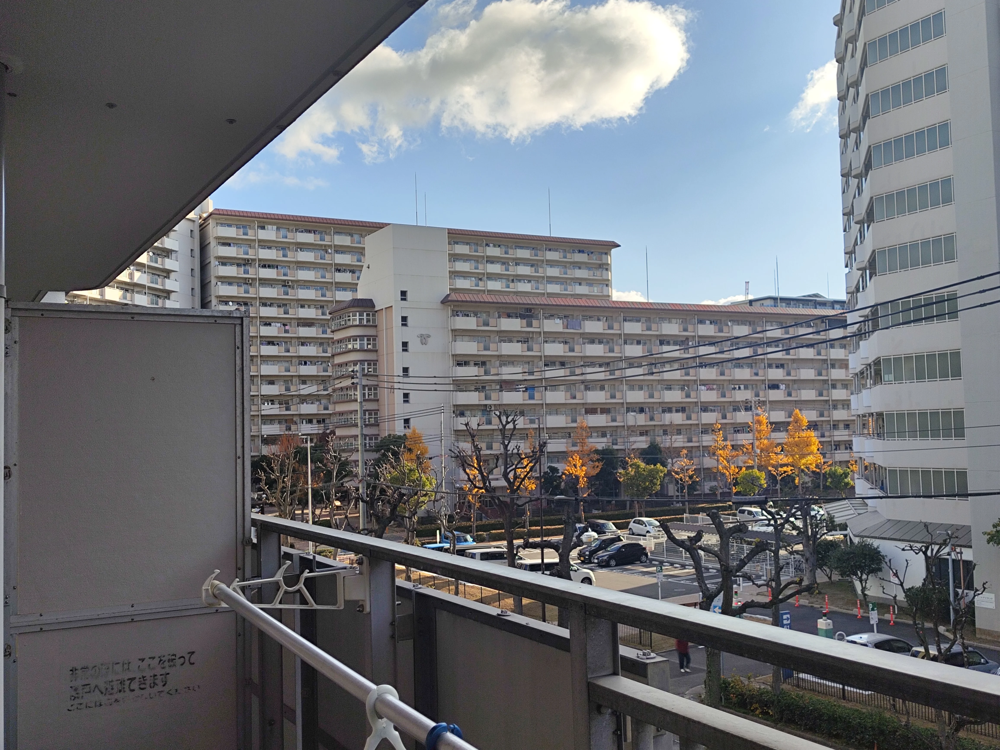

说起来也是很神奇，[第一次我来日本的时候](3.18神户港生田神社自助烤肉摩耶山电车惊魂记.md)，我记得也是到达的第二天我就选择在神户游玩。那一次说实话，在关西的几天天气都不能算得上好，也刚好就是神户那天天气非常不错；[第二次来日本](2024-11-30_神户黑柿子活.md)则是去年的这个时候，也是在神户，也是打算去舞子，当天的天气可以算得上是非常不错了，在舞子大桥还看到了想看的日落。[第三次来日本](2025-05-30_神户高尔夫.md)则是当天下午要从神户起飞回到国内，当天和朋友约好了在神户打高尔夫，本来以外天气不怎样的，结果第二天成功推翻了预报，迎来了大晴天。

至于第四次，也就是这次，依旧是大晴天，神户这个地方确实是待我不薄的。

## 神户大学观景台，但是出现了一些小意外

出门之后，在便利店解决了一下早饭，便坐上了port liner前往三宫，准备换车前往神户大学。

刚好leo也打算前往神大，在车上我们开始对时间。我估摸了一下说不定到时候我两会在公交上遇到，也就是对时间的这会我开始对电车的行先和时刻表开始放松警惕了。**上了电车之后我突然发现我上的电车，并不是我预定中要上的那一班——我早上了一班电车**。

意识到了这一点之后，我当场就找了一个站台下车，打算看看是不是要掉头往回坐。在检查了一下时刻表之后，发现实际上我只需要在另一个站台换车就可以。于是我抓紧往对面站台冲刺，但是在最后爬上楼梯来到站台的时候，要换的车已经关门了。

但是我真的要换车吗？

> 这个时候我还没有意识到我下车的站就已经是我预定要到达的站，我也不知道我是不是太困了没有清醒过来。

在和leo说明情况告诉他我可能要晚到之后，我开始研究新的时刻表，结果却发现我晚到的时间大幅增加了。**而转折点也在此出现——我在车站的显示屏上没有看到预定时刻的那班车**。在经过了多次确认之后，我终于发现了盲点，原来我已经到达了我要到的站，所以在屏幕上找不到能对的上时刻表的那班车。

乌龙解除之后，我发了个信息告诉leo情况，结果没想到他光顾着笑我，自己是正儿八经的坐过站了，而且特急停的站还少，他不得不多花一点钱和时间多坐一趟车才到达神户大学。

---

说完了意外的部分，该说说本身在神户大学逛的这一段时间了。上山因为我觉得爬坡有点累，于是选择了在[六甲道](https://maps.app.goo.gl/dEWEPPcJ8vNu73527)坐BUS上山。刚开始这个站还是没有多少人的，但是看上去上山的学生确实不少，中间BUS开始人挤人，多少是给我挤得有点麻了。

到了神户大学之后，前往百年纪念馆，就可以直接看到观景台了。看上去或许是因为是工作日的大早上，所以这个时候人并不是很多，来这里的人大多数也是游客，带着一台相机，或拍照，或坐在台阶上欣赏风景。

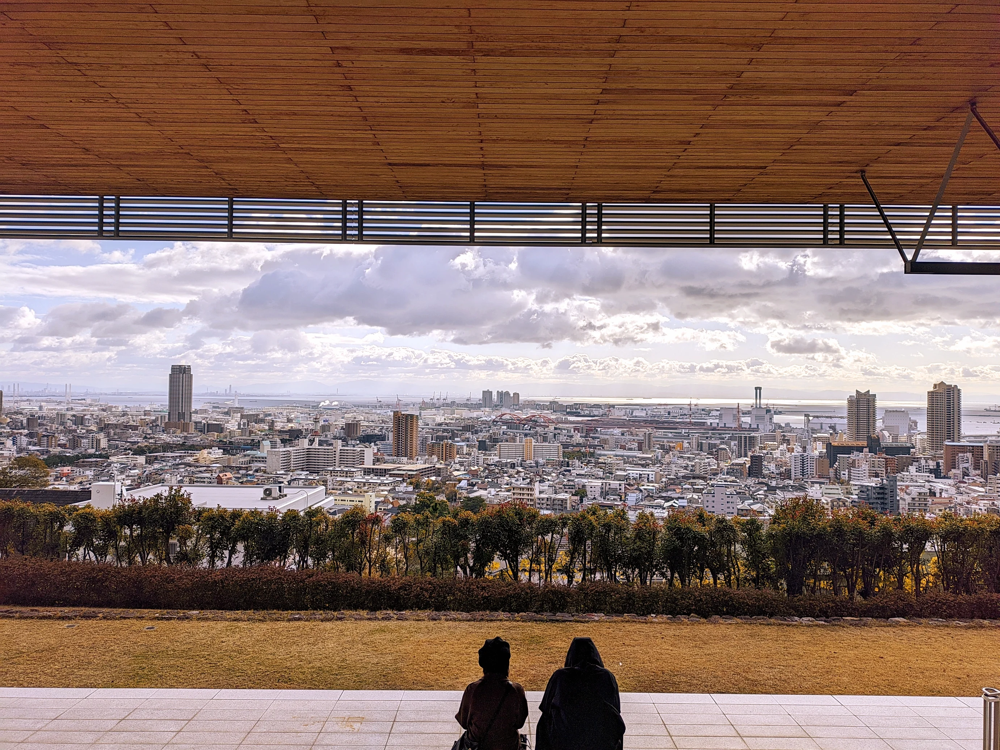

我一直很喜欢这些没有什么人的地方，如果天气好，我大概可以在这里坐半个一个小时多。无奈今天的云还是多了一点，加上冬天的风刮得直往人脖子里钻，实在还是有些太冷了。

刚好因为意外姗姗来迟的leo这会终于到了，我们拍了拍照，便一起下山在三宫附近寻找饭吃。

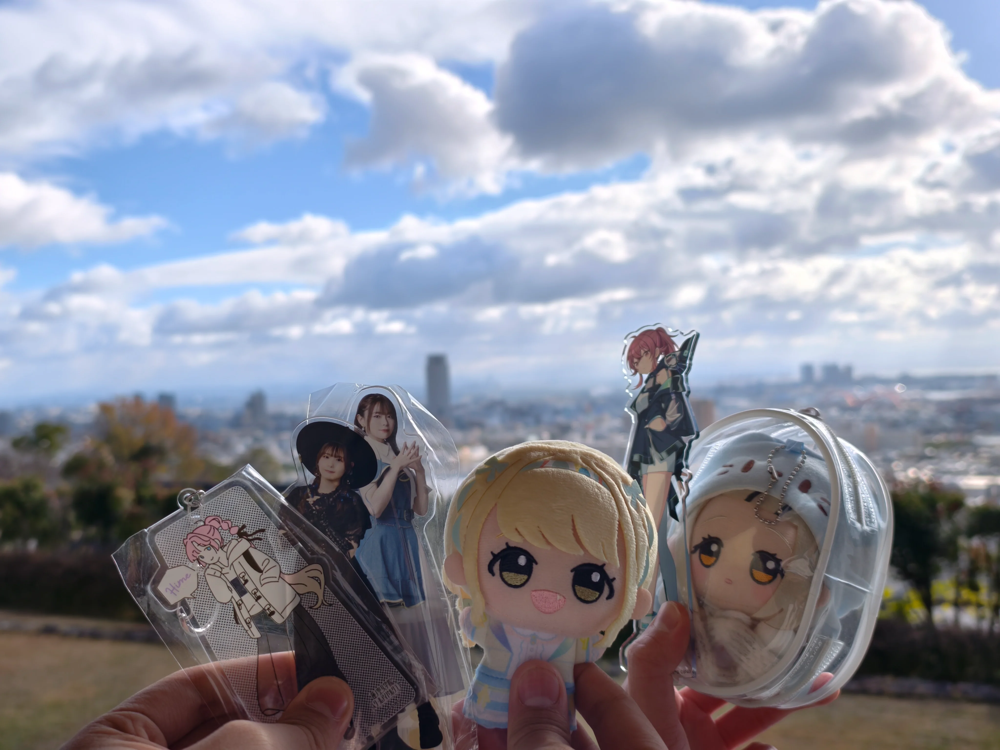

## 三宫附近的平价乌冬店

我们步行下山，在生田神社逛了一下。其实这个地方在我的时候我就已经来过了。所以我也只是再次拍了一下千恋万花的经典镜头和神社里的绘马，便离开了神社。

在路上我看到了我几次来日本想吃都没有吃上的[鸣门鲷烧](https://maps.app.goo.gl/9TstLcJyww8KZpr46)，于是果断这次买了一份红豆馅的，只能说冬天吃点热气腾腾的鲷鱼烧确实是很美好，加上甜的红豆馅，带来的愉悦感是满满的。

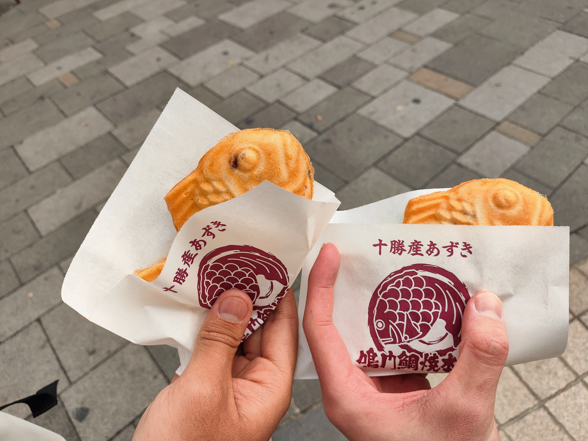

吃过鲷鱼烧之后，我们前往我刚才已经查好的一家人均在1000日元以下的乌冬面——[うどん 京屋](https://tabelog.com/hyogo/A2801/A280102/28020458/)，还好我们去的时间并不算特别晚，赶上了就餐的高峰期，所以不用排队。我点了一份咖喱乌冬 ~~没错就是因为那个咖喱乌冬的meme~~ leo点了一份炸猪排咖喱乌冬，两个人都差不多是1000日元以下就搞定了一顿饭。而且端上来的时候我感觉已经有国内的小份或者中份差不多的大小了，吃完了之后确实感觉有个7分饱的状态。

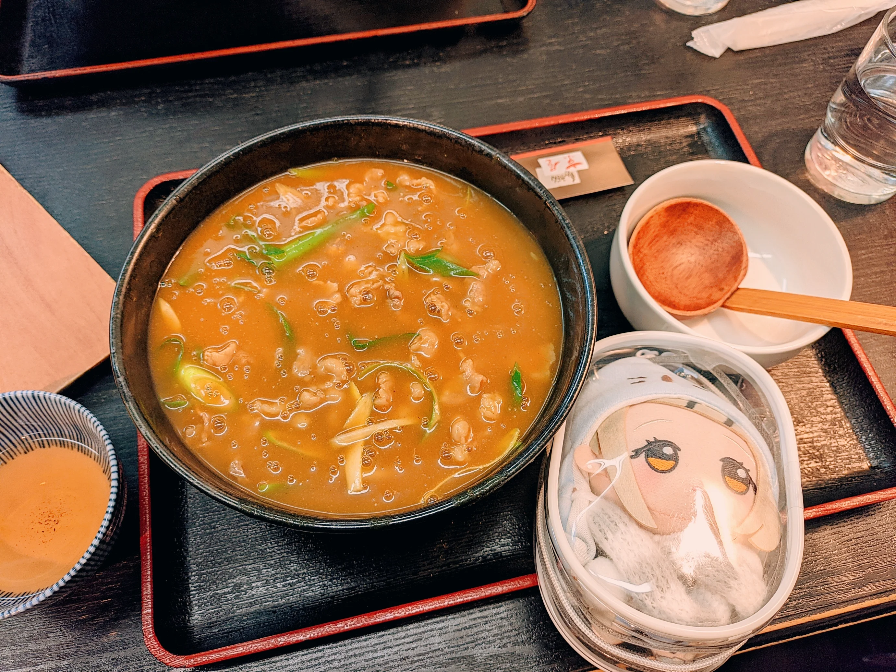

## 二刷美利坚公园&星巴克避风

吃过饭之后，刚好就去海边的美利坚公园溜达溜达。

这个地方也是去年我来过的地方了，天气好的美利坚公园可以无脑来。虽然说今天的天确实是还算挺晴的，但是架不住冷风呼呼的吹。我们在BE KOBE的标志前面拍了个照就已经冷的受不了了，于是赶忙往那家经典的神户星巴克里钻。

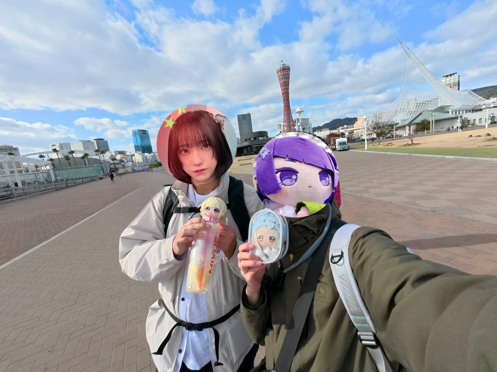

~~另外，刚吃完饭喝完一堆冰水的我不想点星巴克，所以我两白嫖了一会座位~~。

## 二刷舞子

舞子这个地方也是我去年这个时候已经去过的地方，但是上次来看到了非常震撼的日落，而且在沙滩上还拍到了不错的照片。~~考虑到舞子站的读音和带上了一个gop~~，于是舞子这个地方也在本次的计划之内。

但是今天的风实在是太大了，我们刚在神户星巴克避过风，又在JR神户上烤了半天屁股，一下车这舞子大桥底下的风给我们刮得都受不了了。

大桥底下依旧还有那么一批人纹丝不动，是的，是钓鱼佬。本来我也有想过看看要不要借朋友的鱼竿在这个地方杀杀时间，但是想了一下桥底下肯定很大风，而且去温泉的话不一定有地方可以寄存的我的鱼竿，所以最终还是放弃了。

来的时候，舞子的云依旧很多，因为感觉一时半会云不会散开，而且我们的温泉在东边，于是我提议先去东边的沙滩上消磨一下时间。在沙滩上，我把立牌拿了出来，插进了沙子里，拍下了和去年一模一样的构图的照片。

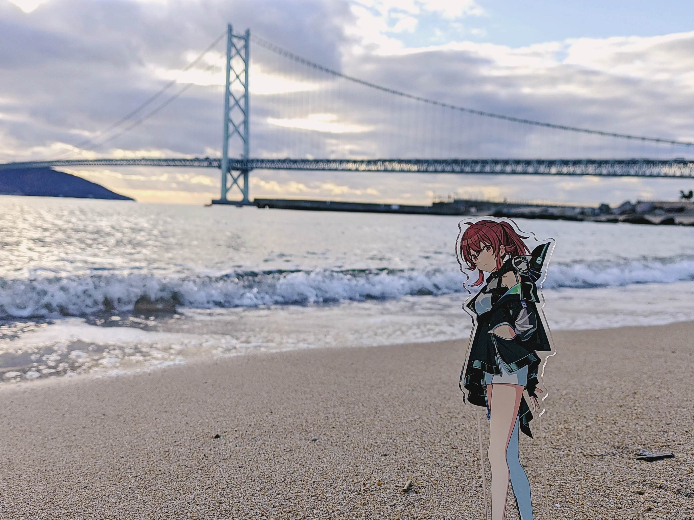

去年的话，则是[这个照片](2024-11-30_神户黑柿子活.md)了。

---

拍过照片之后，离日落大概还有40来分钟，于是我们在台阶上消磨时间。中间太阳短暂的出来了一段时间，我看着拉着长长3的影子，灵机一动，拍下了这张照片。

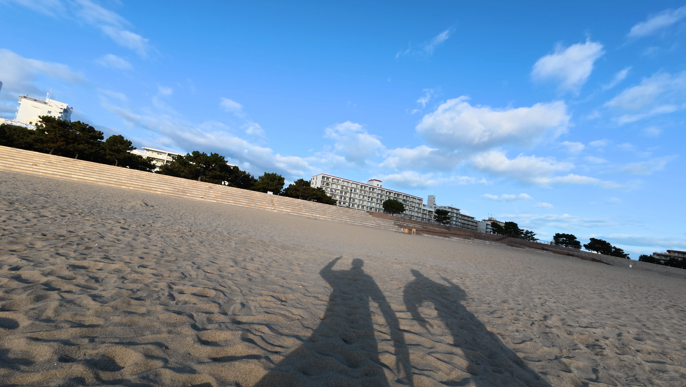

~~嘛，区虽然区，但是也挺有节目效果的不是吗~~。

---

太阳越来越接近海平面，但是云层也逐渐飘了过来。离岸风从我的背后呼呼的吹来，把我冷的不行。这个时候我摸了摸我的背包，**摸到了一个硬硬的方方的东西——我的蓝牙音箱**！原来是我之前一直没有掏出来，在这个日落时分的舞子沙滩，让我想到了非常好玩的东西。于是我把我的彩带、棒子全部掏了出来，连上音箱，不知道放什么，既然gop在场，那就放一首《[エガクミライ](https://open.spotify.com/track/1HNKxinsz9yDUKp68nNnxh?si=d131744f035841bd)》吧。

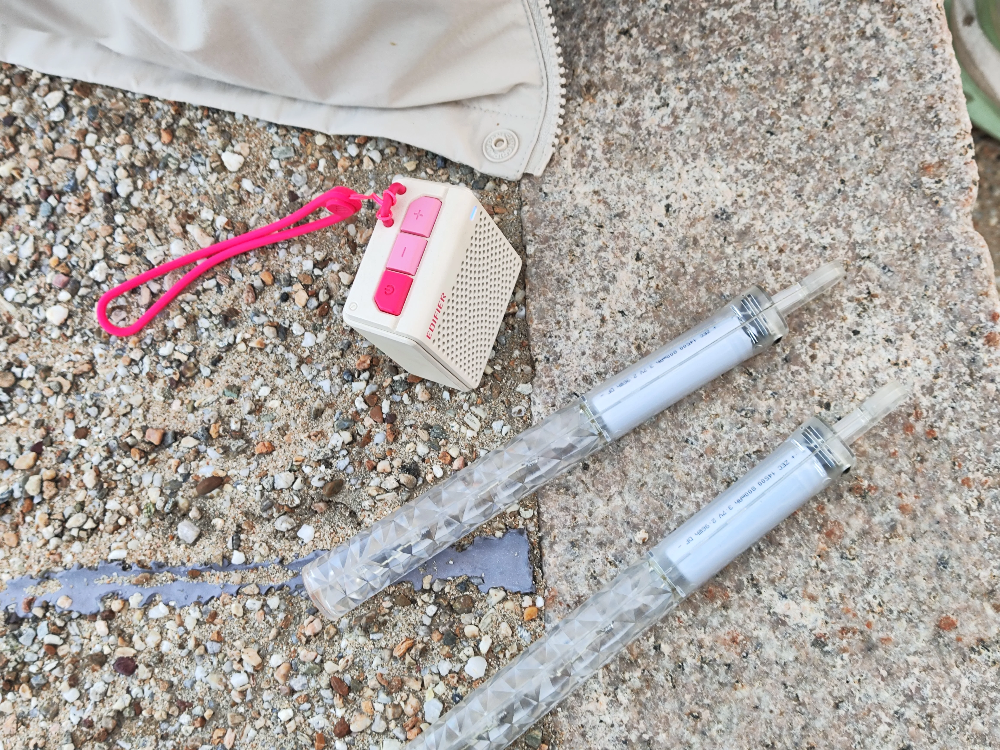

在我俩整活的时候，突然有一对日本高中小情侣走了过来，问我们可不可以帮他们拍张照。虽然日语不好，但是还是应了一声。日本人似乎问了我们一句是不是来这里旅行的，我连蒙带猜的猜出来了意思，日本人说了一句真好啊。~~我心想你们这个天气来舞子拍日落小情侣合照也不赖~~。他们用的相机还是一次性的胶片相机，不得不让我回忆起我高中也买过一个一次性胶片相机，可惜因为种种原因，相机的胶片还没来得及用完，用这个相机的理由就已经不服存在了。

跑偏了，帮他们拍下了一张背影一张正脸后，道谢过后我们就分开了。其实我对我的拍照技术还是非常没有信息的，不知道拍的究竟怎么样。希望他们不要太失望吧）

结果最后，我们也没能等到云散开看到舞子的日落，不过这一段小插曲，倒是给我的旅途增添了不少回忆。

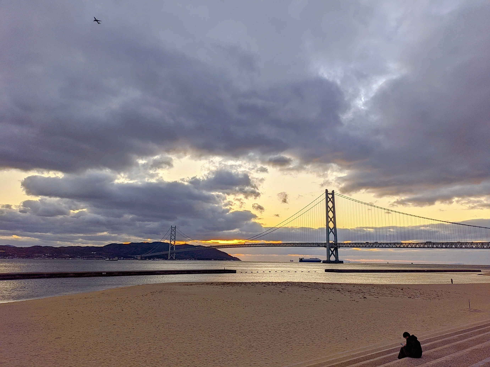

## 前往舞子温泉！

下山之后，气温愈加寒冷。我们快马加鞭赶到我已经提前查好的温泉——[SPA専太平のゆ](https://maps.app.goo.gl/mN5R4hxjzuj1uWuX7)

看上去这家温泉也不是第一次接待外国人了，询问有没有次卡和需不需要毛巾之后，就可以入场了。手环上有条形码，所有的消费都会记录在条形码上，结账的时候扫码支付就可以。这个设计确实挺方便的。

因为温泉里面没有办法拍照，所以只能文字记录一下了。这家温泉还是挺大的，我在东京还没有泡过温泉，关西去的这几家，大概这家是最大的一家了。最小的应该是滋贺的那个温泉，不过所有的温泉都是麻雀虽小五脏俱全的，加上价格全都是1k左右，这个价格属于是没有什么可以挑剔的地方。

室内的池子除了有传统的静水和流动水池，还有特殊的带电的温泉，说实话刚进去一会我就有些受不住了，~~这东西电屁股的~~。

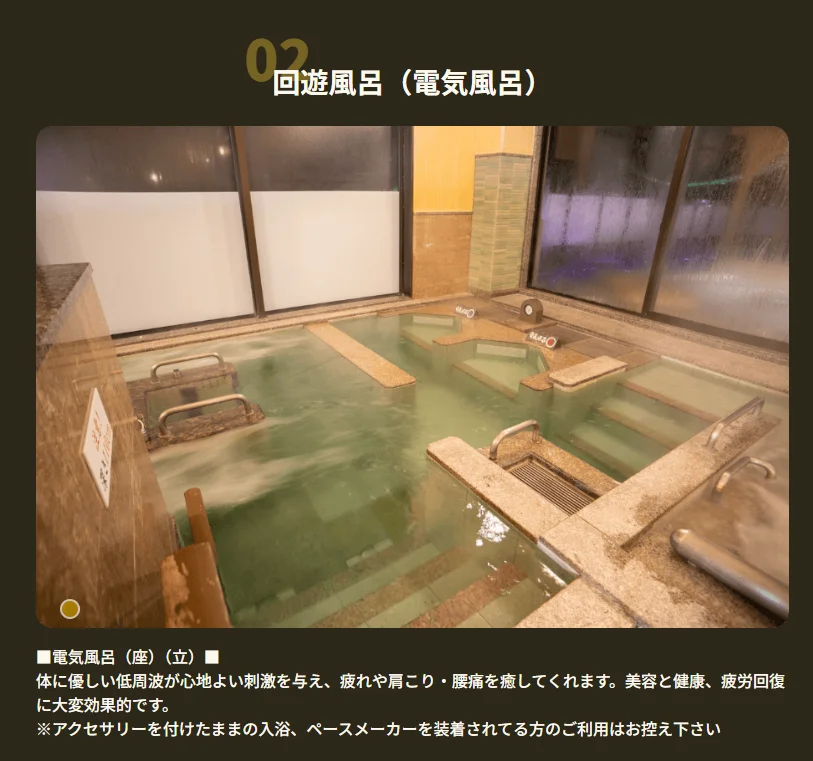

户外的池子的种类就很多了，**其中碳酸池的温度和功效应该是我觉得综合大众最能接受的一个了**。

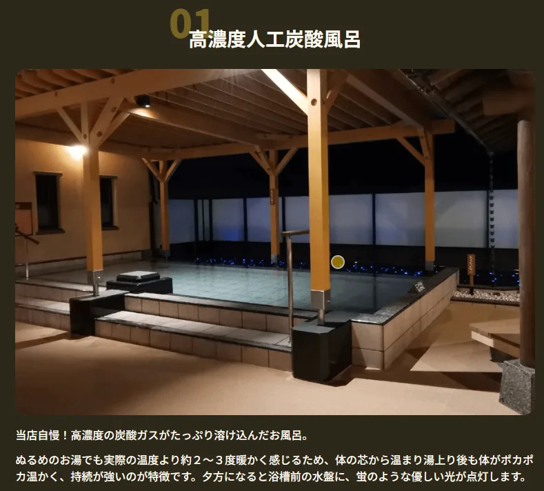

另外户外那个蒸汽房，一开始我本以为是桑拿房，结果进去伸手不见五指，而且还有盐放在房里面，进去的一瞬间我就知道我进错了房，呆了不到半分钟便慌慌张张的跑了出来，只能说确实是不清楚这个房间是怎么呆的。

我按照之前几次学到的泡温泉的办法，先在室内的流动水池里泡了一会，然后在室外的几个池子里换着泡了泡，最后去桑拿房蒸出一身汗，然后进冷水池泡个半分钟，出来稍作休息，便是一个循环。就这样差不多跑泡了3个循环，接近一个小时的时间，感觉实在是有点顶不住了才出来。

---

泡完出来大概已经是7点多了，我们打算直接在留下的餐厅吃一顿饭。价格居然也是1k左右，对于这个温泉来说价格可以算得上是非常便宜的。我点了份很久没吃的亲子丼，美美的吃了一顿饭。

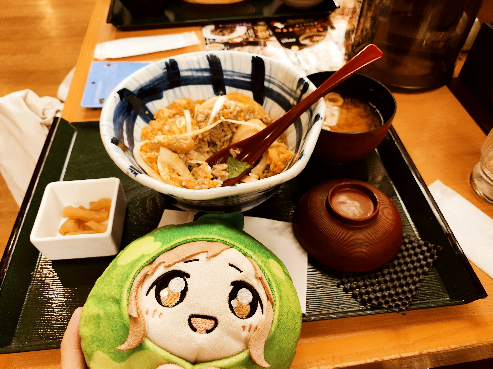

## 解散！回到住处

吃过饭后，我们在三宫站就此告别。明日，就要离开神户，前往心心念念的大阪巨蛋了。