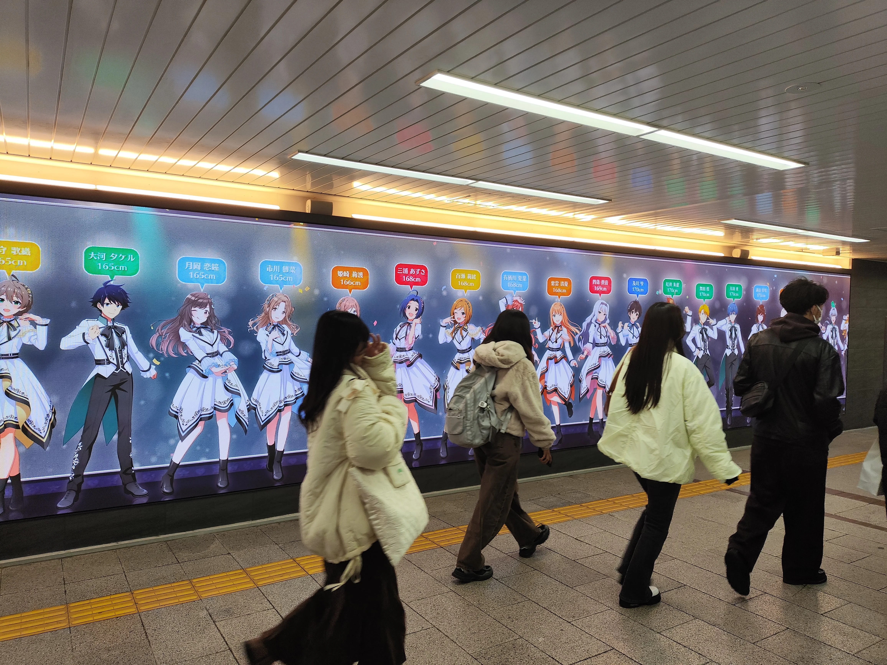
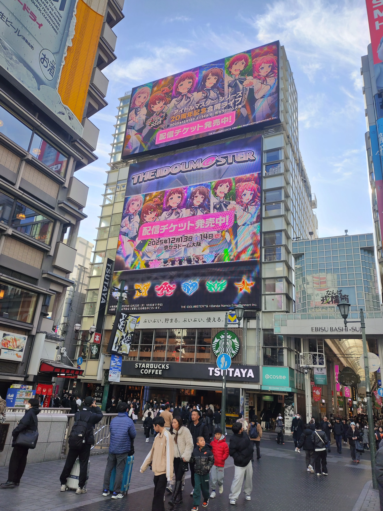
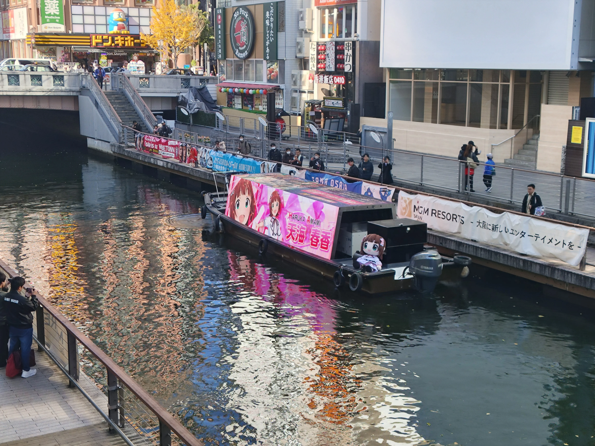
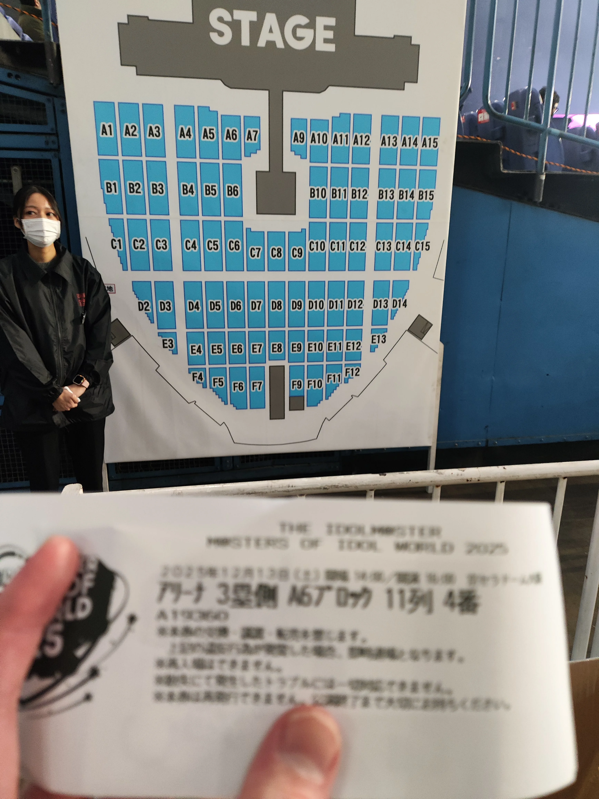

## 离开神户，前往大阪

今天早上醒来，就看到昨天半夜朋友已经提前完成了录音的工作——也就说今天早上我可以提前一点去大阪了。刚好考虑到逛难波需要一点时间，于是我就提前在7点半的时候起床了。

坐上阪神，开始向着大阪出发。因为昨天实在是太冷了，今天我把我的毛线帽子和我的围巾全部都拿了出来了，确实是暖和了不少，但是上了车之后就开始热了。而且明显感觉阪神的座椅温度要比JR和神户新交通高出不少，下车的时候感觉我的裤子都是热的。

## 难波闲逛

在朋友家安置好东西，便出发前往难波。

### 难波站内广告

在难波站内，看到了爱马仕的大广告。因为已经是周六，而且这个站还是人最多的难波站，拍照的P们已经排起了长龙。我的手机没有合适的广角，加上人实在是太多了，只能从侧面拍下来一张照片。

在这个广告对面，则是一个大屏幕，正在循环播放MOIW25的广告。介绍小偶像的时候会根据身高滚动过去，用action简单的录了一下就离开了。

---

除了官方的广告，在站内还有粉丝制作的其他爱马仕的广告。这个小糸的广告真的很可爱。

### 心斋桥广告

出了难波站，便开始寻找万代在游客最多的格力高广告附近头投放的大帅广告了。我的运气其实算非常好的，因为这个爱马仕的广告基本上要十几二十分钟可能才会出来一次。我刚到桥上的时候刚刚好赶上广告出来，手快直接拍了一张照片。

另外这个广告牌还有闪彩虹之行方MV的广告，当然也拍了，不过在博客暂时就不放出来了。

另外，在这个桥的下面，刚好还有爱马仕广告的游船。我的运气继续发力，刚好拍完照就来了一班游船，船上还有本家信号灯的巨大玩偶，实在是太搞了。

刚好在这里也有不少国人在拍照，和国人临时换了个名片，便开始向着MOPW的会场进发。

## MOPW——参加过的最棒的同人活动

MOPW是我就已经预计参加的活动。等我逛完难波，活动已经差不多开始了半个小时了。本以为活动是可以直接进去的，结果到了却发现已经排了不少人，得知需要排大概30分钟以上，我觉得还是有必要参加一下，于是果断排队了。

进到会场内，主办方发放的东西非常之多，有各家的call本，也有一些独特的企划的宣传。其中让我印象最深刻的，肯定是国人制作的一个全企划的应援指南。

> 这位主催的个人空间链接：https://space.bilibili.com/85326413/dynamic  
> 关于这个call本的动态：https://www.bilibili.com/opus/1143575831887478785

这本应援指南不仅有偶像大师各个事务所本次预测曲目的call guide，还有一些基本的应援知识和注意事项，做的真的特别精美，不知道有没有电子版本可以公开一下，我觉得非常值得拿一本好好的收藏起来。

可惜我自己的日语实在太差了，不知道如何和日本P交流。印象最深的还是看到了之前成田牧场和雪步联动的那个挖洞大赛，看到了一个拿了奖的P和他的立牌，兴奋的和朋友说这个活动，还拿到了他的名片，本来还想说点什么，因为日语实在太差，这个时候就是学到用时方恨少了。

最后还有BJD的展示环节 ~~说实话肯定这些娃娃不能全部算成BJD 但是我也不知道究竟该怎么说了~~ 不得不感慨大家养娃养的真的很好看

## MOIW D1 本番

看完无料活动之后，在松乃屋吃了个炸猪排套餐（因为今天有手球出演）我们一行人便前往巨蛋前站。

今天我是一个人入场，我的票还因为一开始网络问题从队伍里退出来被stf二次抽查了，好在我没有偷懒，F12改了一下，顺利的入场了。因为这么抽查一下，导致一开始我并没有确认我自己的座位——直到我走到了要进蛋里面的地方才发现。**内场，并且是最前最中间的block**。

> 虽然有点模糊了但是还是能看见，A6 11列 4番

你要说是最前吗，那也不是，但这里可是巨蛋啊。我这一年去过了2k人的立川花园，也去过了2w人的KA，都没有过相对这么好的座位。走到座位上的时候我还没有回过神了，没想到有一天我也能在这么大的场子里坐到这么前的位置。

---

其实我本来想对歌单按照顺序一首首进行点评的，但是这样太流水帐了，我想避免一下这样的形式，那就按几个不同的分类来点评吧。

### 今天的金曲

那肯定是灰姑娘的《[Orange Sapphire](https://open.spotify.com/track/5dpeobghiDp2rgNavnt3RI?si=7944856faa8b48c5)》，由男人演唱。

<iframe data-testid="embed-iframe" style="border-radius:12px" src="https://open.spotify.com/embed/track/5dpeobghiDp2rgNavnt3RI?utm_source=generator" width="100%" height="352" frameBorder="0" allowfullscreen="" allow="autoplay; clipboard-write; encrypted-media; fullscreen; picture-in-picture" loading="lazy"></iframe>

一到副歌只能看到绿色和一片山火的橙色，而且大家喊的那一声“Passion！"可以说是齐的不能再齐。哪怕是有薯ki的今天，我也只能说比起正儿八经的这首歌，还是差了一点意思。

### 今天最搞笑的曲目

其实在选择这个曲目的时候我思考了很久，究竟是给到大合唱的薯ki还是给别的有梗的曲目。在最后我只能两个都选择：《[自己肯定感爆上げ↑↑しゅきしゅきソング](https://open.spotify.com/track/6ATiUNyUXvHbKZ4NOsZUxm?si=5bd1004af439421e)》和《[愛 LIKE ハンバーガー](https://youtu.be/4xzu8x_SOoM?si=3PhrSc35RncKW63Q)》

<iframe data-testid="embed-iframe" style="border-radius:12px" src="https://open.spotify.com/embed/track/6ATiUNyUXvHbKZ4NOsZUxm?utm_source=generator" width="100%" height="352" frameBorder="0" allowfullscreen="" allow="autoplay; clipboard-write; encrypted-media; fullscreen; picture-in-picture" loading="lazy"></iframe>

<iframe width="560" height="315" src="https://www.youtube.com/embed/4xzu8x_SOoM?si=xF9U04mD-5tTt2hZ&amp;controls=0" title="YouTube video player" frameborder="0" allow="accelerometer; autoplay; clipboard-write; encrypted-media; gyroscope; picture-in-picture; web-share" referrerpolicy="strict-origin-when-cross-origin" allowfullscreen></iframe>

我还能说什么呢，前面这首歌出来大家都一块笑了，不知道老资历P听到这首歌全场合唱的时候是作何反应。~~合唱春日影也真的只能图一乐，牛逼的还得看我们阪蛋5w5人一块合唱薯鸡从头唱到尾~~。而汉堡包这一首曲子因为有小鹿在，出来那一句hamburger的时候直接给我笑喷了。

### 今天最好玩的曲目

我觉得这个曲目可以当之无愧的直接给到《[紅白応援V(ビクトリー)](https://youtu.be/SrJfZs4Wwy0?si=gtSeDslE4GVfPTvI)》

<iframe width="560" height="315" src="https://www.youtube.com/embed/SrJfZs4Wwy0?si=gtSeDslE4GVfPTvI" title="YouTube video player" frameborder="0" allow="accelerometer; autoplay; clipboard-write; encrypted-media; gyroscope; picture-in-picture; web-share" referrerpolicy="strict-origin-when-cross-origin" allowfullscreen></iframe>

2w多人给红组应援，另外2w多人则给白组应援。加上这首本来就是call曲的缘故，现场的氛围直接被炒到最高。刚好我的位置是左半边的红组，而且hnk人就在差不多我的正前方的地方，直接给我喊爽了。

### 今天最帅的曲目

想来想去，决定还是把这个曲目给《[ULTIMATE FLAME](https://open.spotify.com/track/2qBDbEMmxqDgssD6vxFdwL?si=d82fe5cb71394dde)》

<iframe data-testid="embed-iframe" style="border-radius:12px" src="https://open.spotify.com/embed/track/2qBDbEMmxqDgssD6vxFdwL?utm_source=generator" width="100%" height="152" frameBorder="0" allowfullscreen="" allow="autoplay; clipboard-write; encrypted-media; fullscreen; picture-in-picture" loading="lazy"></iframe>

这首歌的OH OH OH环境举起手握拳打call的环节真的很帅，加上男人的动作也非常的有力。而且配合上喷火的舞台，从视听和身体感受到的热浪来说，应该是我今天听到的最帅的曲子了。

### 今天最感动的曲子

> 时空警察：其实两日的MOIW都不算有煽情的曲目（不算i need you）但是我还是想挑一些我听了感觉非常感动的曲子出来。

我想这个曲子，我应该会给到灰姑娘的《[君のステージ衣装、本当は…](https://open.spotify.com/track/0ZpzYslmZgcTFNGhBLWgEx?si=9a7d3038826f47cf)》

<iframe data-testid="embed-iframe" style="border-radius:12px" src="https://open.spotify.com/embed/track/0ZpzYslmZgcTFNGhBLWgEx?utm_source=generator" width="100%" height="152" frameBorder="0" allowfullscreen="" allow="autoplay; clipboard-write; encrypted-media; fullscreen; picture-in-picture" loading="lazy"></iframe>

说起来，灰灰真的是我比较不熟的事务所。但是kraz和浅仓还有紫月在台上唱这首歌就感觉，有一种非常美好的感觉。~~大抵是对雪步还有日花花的好感导致的吧，这几个娃本来就很洁白无暇~~。

### 今天最遗憾的曲子

最遗憾的曲子其实还是因为学不能越境，所以大概《[雨上がりのアイリス](https://open.spotify.com/track/4ZuVc6O8aRj5hlqBmEeqwJ?si=a27c881716464a00)》这首会比较遗憾，我希望能听到本灰百都上来一块越境的。

<iframe data-testid="embed-iframe" style="border-radius:12px" src="https://open.spotify.com/embed/track/4ZuVc6O8aRj5hlqBmEeqwJ?utm_source=generator" width="100%" height="352" frameBorder="0" allowfullscreen="" allow="autoplay; clipboard-write; encrypted-media; fullscreen; picture-in-picture" loading="lazy"></iframe>

## D1结束后

当合唱完 i need you的最后一句话的时候，d1的演出也就落下了帷幕。很遗憾坐在内场结果却没有拿到彩带，不过好在off会有朋友发力给我们送了彩带。大家在off会也非常开心的聊着今天的歌单，只能说比上次[闪彩D1的时候](2025-10-25_闪彩d1.md)好了太多了。和大家吃了一会串喝了一会酒之后，便高高兴兴的回到了住处，好好休息，等待明天的d2。