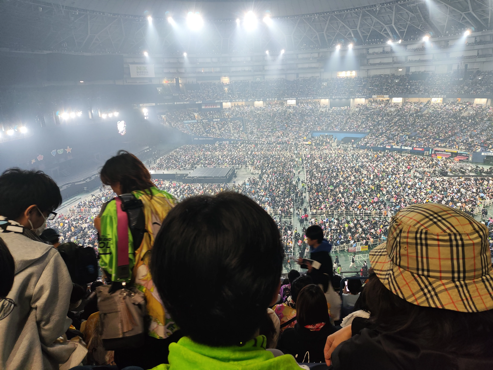

今天是在日本的倒数第二天，也是实际我能好好享受的最后一天。于是我又早早的醒了，为了把时间充分的利用起来。

## 阪蛋打卡集章活动

MOIW25官方有一个，我也提前做好了计划。到达场馆之后，我便开始一个个寻找打卡的地方。还好立牌都不难找，而且引导也比较OK，大概花了半个小时就把6个点的卡全部打上了。

最后拿到了两张小卡——一张是d1的，一张是d2的，各企划选了一个人出来作为代表。

### 打卡时的痛车展示活动

在打卡的时候，最后一个打卡点是真哥哥的，设置在屋顶的痛车展示会场。

说实话，一开始我已经忘了有这么一回事了，来了之后才突然想起来。我其实还挺喜欢车的，说实话，看痛车更是一种享受。图片太多，就放一张自己最喜欢的吧。神秘月曜女没来，但是有她的痛车在。

## 阪蛋国人大合照

中午我们在弁天町吃了饭，眼看着差不多到了2点半国人大合照的时间，于是我们步行直接前往阪蛋。

等真的到了合照的gate，才发现原来国人有这么这么多。大家眼神一对上，立马名片就已经掏了出来。眨眼间，我手里的学马名片就已经发完了，就连我带了一盒的闪彩名片都发的只剩下了两张。而我的名片册则已经几乎满满当当了。老钟的P还是太热情，太卷了。拿到了好多设计精美的名片，不得不感慨大家平设的水平之高和思路之精妙。

等到突然一喊合照可以开始准备了，我才慌慌忙忙的赶到旁边，举起我的鸽子2浴巾，和在场的国人一起留下了一张合影——在这个特殊的时期，这张合影便有了一份独特的意义。

## MOIW D2 本番

今天因为是一般二次的票，所以已经做好了上山的准备。事实也的确如此，被分配到了大概是上层看台的山顶。不过考虑到的话，也已经非常可以接受了。

---

又到了该盘点曲目的时间。

### 今天的金曲

今天的金曲难道还能有第二个吗？出来了没人不会不记得迷光和THE 虎牙道的打戏，太精彩了，这才叫做舞台表演，我应该一辈子都不会忘记《[Ray of Light](https://open.spotify.com/track/38b1LQOcS8mENU5PwGvmcw?si=534845fbff8f42d2)》这首歌了。

<iframe data-testid="embed-iframe" style="border-radius:12px" src="https://open.spotify.com/embed/track/38b1LQOcS8mENU5PwGvmcw?utm_source=generator" width="100%" height="152" frameBorder="0" allowfullscreen="" allow="autoplay; clipboard-write; encrypted-media; fullscreen; picture-in-picture" loading="lazy"></iframe>

### 今天最搞笑的曲目

今天的燃曲、帅曲很多，硬要说像昨天薯鸡那班整蛊的曲子，似乎真的很难挑出来。硬着头皮挑了一下，应该还是妹妹的这首《[つよつよ最強エクササイズ](https://open.spotify.com/track/3XFB1dLIGcVDHIvpVZaaBC?si=7c4ac8479ff64ae0)》，只能说确实是笑出声来了。

<iframe data-testid="embed-iframe" style="border-radius:12px" src="https://open.spotify.com/embed/track/3XFB1dLIGcVDHIvpVZaaBC?utm_source=generator" width="100%" height="152" frameBorder="0" allowfullscreen="" allow="autoplay; clipboard-write; encrypted-media; fullscreen; picture-in-picture" loading="lazy"></iframe>

### 今天最好玩的曲目

虽然今天没有了红白应援的环节，但是迷光的《[Cyber Parkour](https://open.spotify.com/track/3OzNV9mVz3h4MZnDxJieR3?si=de136735ac384e96)》我觉得也是非常不赖的。这次并不是由迷光三个人来说那几句经典的“邀你进入网络奇幻世界了”，男人的这几句中文感觉是这几个人中间最标准的那一个了。

<iframe data-testid="embed-iframe" style="border-radius:12px" src="https://open.spotify.com/embed/track/3OzNV9mVz3h4MZnDxJieR3?utm_source=generator" width="100%" height="152" frameBorder="0" allowfullscreen="" allow="autoplay; clipboard-write; encrypted-media; fullscreen; picture-in-picture" loading="lazy"></iframe>

### 今天最帅的曲目

如果ray of light不能重复选择的话，那我还有一个可以立马脱口而出的曲子，就是安缇卡的《[とある英雄たちの物語](https://open.spotify.com/track/51uoVJJ2HsKCX1hddy72xS?si=683e233ccb8546e8)》

这首歌的yes yes yes my lord全场一起call，效果并不亚于昨天男人的oh oh oh。而且灰的关口里咲真的蛮帅的，出来那下低音属实是帅到我了。而且没想到淑女也唱了这首歌，可以说是非常惊喜的人选了。

<iframe data-testid="embed-iframe" style="border-radius:12px" src="https://open.spotify.com/embed/track/51uoVJJ2HsKCX1hddy72xS?utm_source=generator" width="100%" height="152" frameBorder="0" allowfullscreen="" allow="autoplay; clipboard-write; encrypted-media; fullscreen; picture-in-picture" loading="lazy"></iframe>

### 今天最感动的曲子

说实话，这个环节我肯定要加我自己的私货了，那么就是星组的《[Shower of Light](https://open.spotify.com/track/2QhslhZQ9RsoGHl0ayHLVZ?si=03471215aa39438b)》至于原因也非常明显了，毕竟uka羽化的剧情，加上23年00的缺席，都让我不得不选择星组的这首歌。

<iframe data-testid="embed-iframe" style="border-radius:12px" src="https://open.spotify.com/embed/track/2QhslhZQ9RsoGHl0ayHLVZ?utm_source=generator" width="100%" height="152" frameBorder="0" allowfullscreen="" allow="autoplay; clipboard-write; encrypted-media; fullscreen; picture-in-picture" loading="lazy"></iframe>

### 今天最遗憾的曲子

学马啊学马，为什么不能越境呢。明明我都已经想好了《[Star-mine](https://open.spotify.com/track/5feby3UfawInDtv8BG0UCx?si=53f93429bea440a8)》完完全全可以安排和星组一起跨境。

<iframe data-testid="embed-iframe" style="border-radius:12px" src="https://open.spotify.com/embed/track/5feby3UfawInDtv8BG0UCx?utm_source=generator" width="100%" height="152" frameBorder="0" allowfullscreen="" allow="autoplay; clipboard-write; encrypted-media; fullscreen; picture-in-picture" loading="lazy"></iframe>

但说实话，我不想说学越境这个事情太多次。不如说今天闪的选曲除了迷光恐怕也比较的NPC。首先星组被偷了光洗澡没还回去，而且我觉得光洗澡虽然很感动，但是因为有uka剧情所以跨境感觉并不是特别合适；另外虽然水的365日和学的互动我非常爱看，但是感觉水组明明有更多更合适甚至可以找人上来弹吉他的曲目却没有选……今天的歌单反而比起D1给我留下的遗憾太多，而且也没有等到大师片的环节。

可能还是人太多了吧……毕竟人越多，而总时长一直差不多，还是得做出一些取舍的……

## D2结束后

D2结束后，因为在山顶而且第二天就要飞走，所以我也在还没有完全谢幕完的时候就拎着背包跑路了。说实话这个决定也算比较正确，因为大新闻只有明年的MOIW xR，播片我是有想法考虑看一次，但是如果是MOIW的话，暂时还没有……我比较想看喜欢弄抽象东西的小高在xR上整点他的艺术，~~因为他的抽象特性反而在xR上会看到比较惊喜的编排~~。

在OFF会，匹配到了新的朋友，也有第一天就已经来了OFF的朋友。坐在昨天的位置上，但MOIW已经结束了。虽有略显遗憾的歌单和明天就要离开的遗憾，但live的后劲还是盖过了它。

在OFF会上，我说，应该明年会找一个机会看看男人吧。这并不是一句玩笑话，两天过去，给我留下最深印象的就是男人的舞台表演和张力。SideM是一般向2企划而并非女性向，我觉得不能带着有色的眼镜去看，而这两天也真的让我了解到了SideM舞台的魅力之处。

另外，在off会上，也有另一位管马P，在尽心尽力的宣传工体馆的管人live。25年的vtb企划并不容易，而且还是不打算像武士道那样做真人的管人企划。这两日的管人曲子确实给我留下了很深的印象，除了VVV这种call的很爽的曲子，管人的《[RELOADING](https://open.spotify.com/track/5sSGh8joKRQ6Qw3Zb42W8P?si=db0215dd42dd475c)》也非常的帅，我觉得稍微给万代一些时间，管马走的路或许能比自家本来一开始也是管人企划的莲之空走的更远。

<iframe data-testid="embed-iframe" style="border-radius:12px" src="https://open.spotify.com/embed/track/5sSGh8joKRQ6Qw3Zb42W8P?utm_source=generator" width="100%" height="152" frameBorder="0" allowfullscreen="" allow="autoplay; clipboard-write; encrypted-media; fullscreen; picture-in-picture" loading="lazy"></iframe>

很幸运能够见证偶像大师20周年盛大的演出。从今往后也会继续陪伴偶像大师，希望下一次的MOIW，我能以更熟悉的姿态来参加。